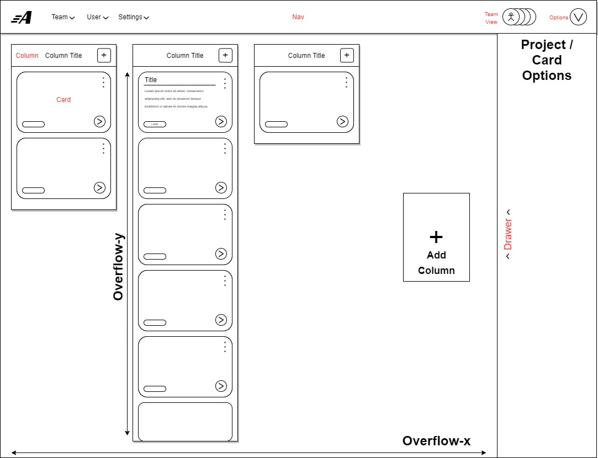
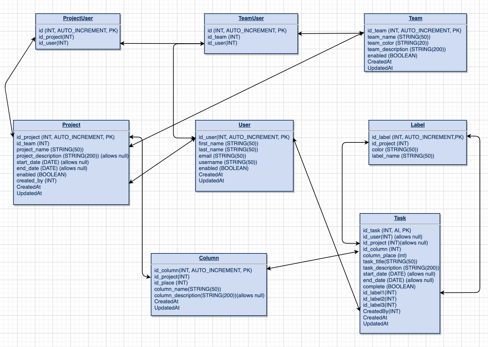

# Autoban

View the deployed application <a href= "https://autobanprod.herokuapp.com/"> here!</a>

## Value Add Proposal

An app that:

- Allows users to create kanban boards for their projects
- Allow users to collaborate in real-time with their project teams
- Allow users to re-order and organize project tasks
- Create multiple views for displaying project tasks

## Team Members:

- <a href="https://github.com/andrewvenson">Andrew Venson</a>
- <a href="https://github.com/kwilks3">Kim Wilks</a>
- <a href="https://github.com/mmomin11">Mubin Momin</a>
- <a href="https://github.com/tan-x">Tanner Griffin</a>

## Documentation

Components:

Database:

## Tech Stack

- React
- Sequlize
- MySQL
- Socket.io
- Electron
- Tailwind
- Express

## License

MIT License
