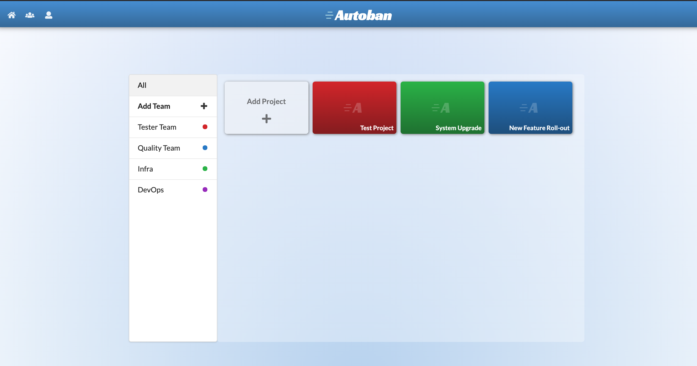
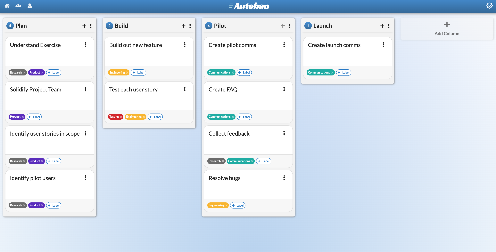

# Autoban

View the deployed application <a href= "https://autobanprod.herokuapp.com/"> here!</a> 

View the PowerPoint for the second sprint <a href= "https://docs.google.com/presentation/d/1zmsPdy9xXE9pTHdgdTNd9nq7dBo96hZLRUCZ8OtMB5g/edit?usp=sharing"> here!</a>

## Value Add Proposal

An app that:

- Allows users to create kanban boards for projects
- Allows users to create teams and create projects assigned to those teams
- View all projects and teams in their unique home page

## Team Members:

- <a href="https://github.com/andrewvenson">Andrew Venson</a>
- <a href="https://github.com/kwilks3">Kim Wilks</a>
- <a href="https://github.com/mmomin11">Mubin Momin</a>
- <a href="https://github.com/tan-x">Tanner Griffin</a>

## Tech Stack

- React
- Sequelize
- MySQL
- Socket.io
- Semantic UI
- Express
- MongoDB

## Sprint 1

- Conceptualization and Planning of UI and Database structure
- Built out Project view with corresponding components (Columns, Tasks, Drawer, Header, Labels, etc.)
- Built out Home view to create Teams and Projects
- Built back-end models and controllers using Express and MySQL
- Implented Socket.io for real-time updates from server
- User sign in authentication with Firebase

## Sprint 2

- Bug fixes
- User avatar addition
- Personal team creation on user creation
- Edit team name and description in the team information sidebar
- Search for users and add them to your team
- Accept or reject team invites
- Edit project name and description
- Implementing "drag and drop" option for tasks using ReactDnD
- Moved tasks to NoSQL database (MongoDB)
- Allow deletion of tasks and columns (cascading)
- Search for labels to add to a task 
- Use Test-Driven Development (TDD) for new features

## Documentation

Components:

Database:

Home Page:

Project Board:

## License

MIT License
